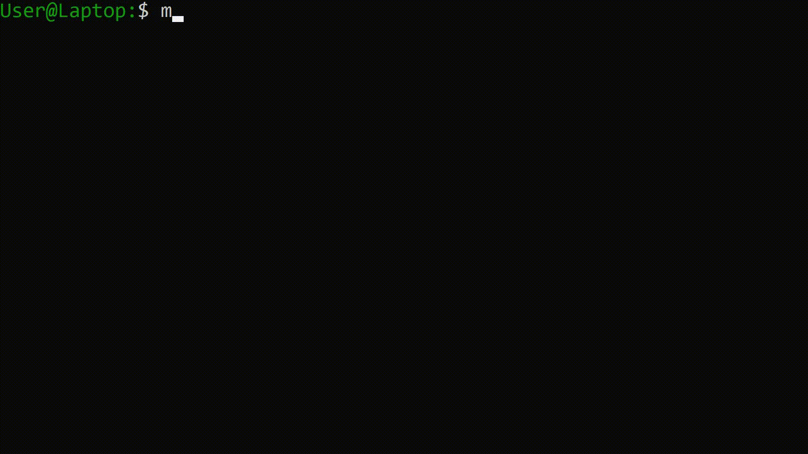
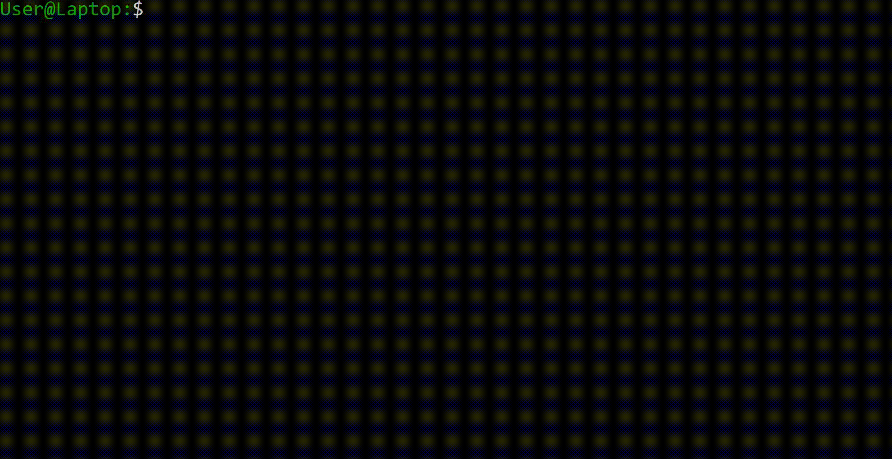
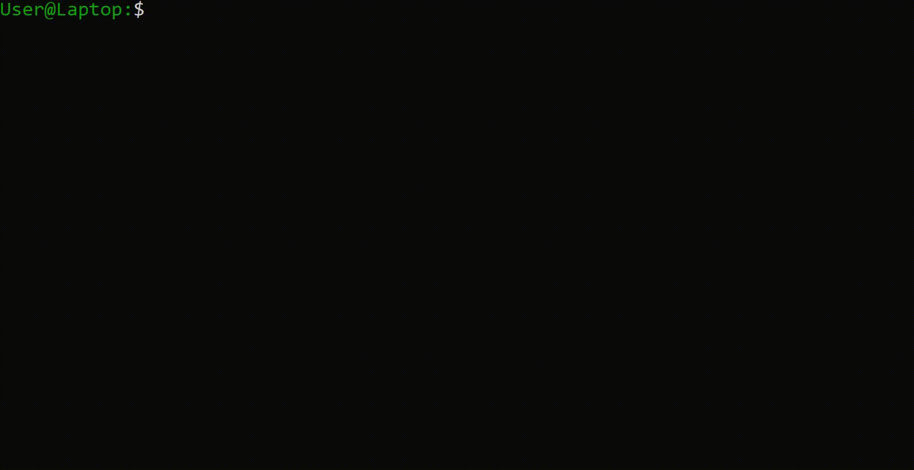
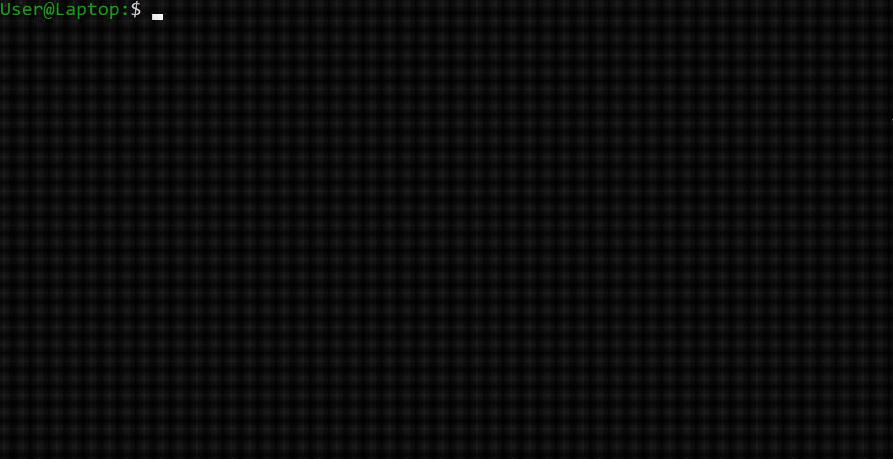
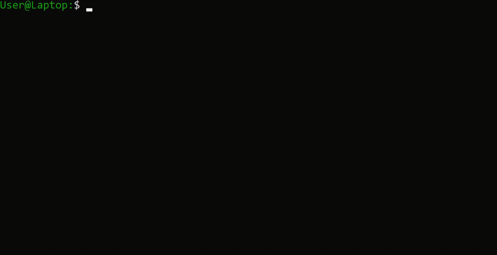
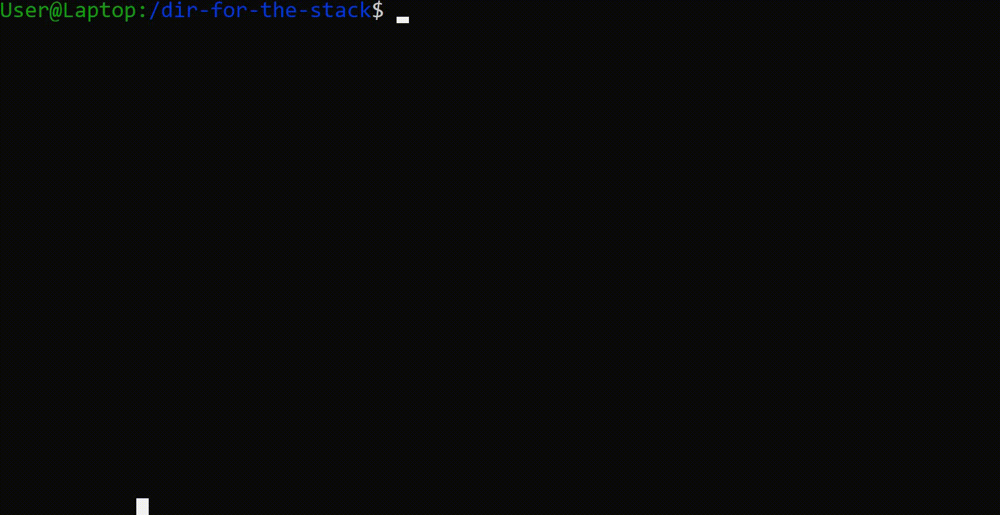
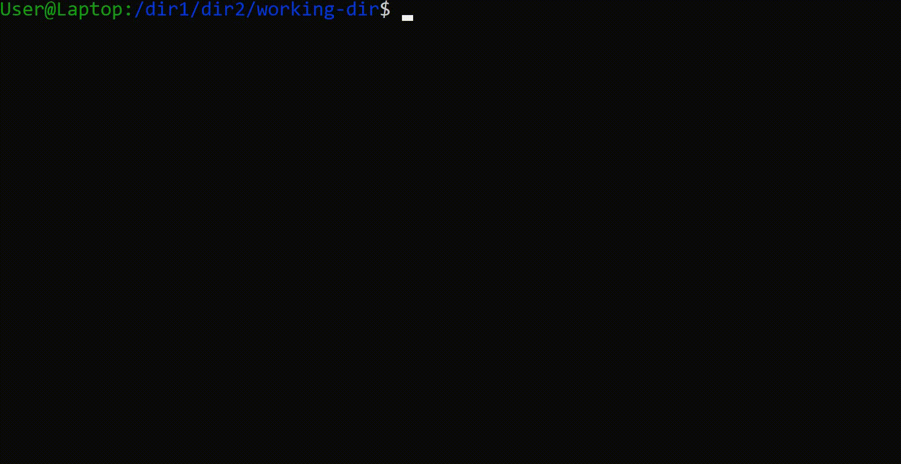
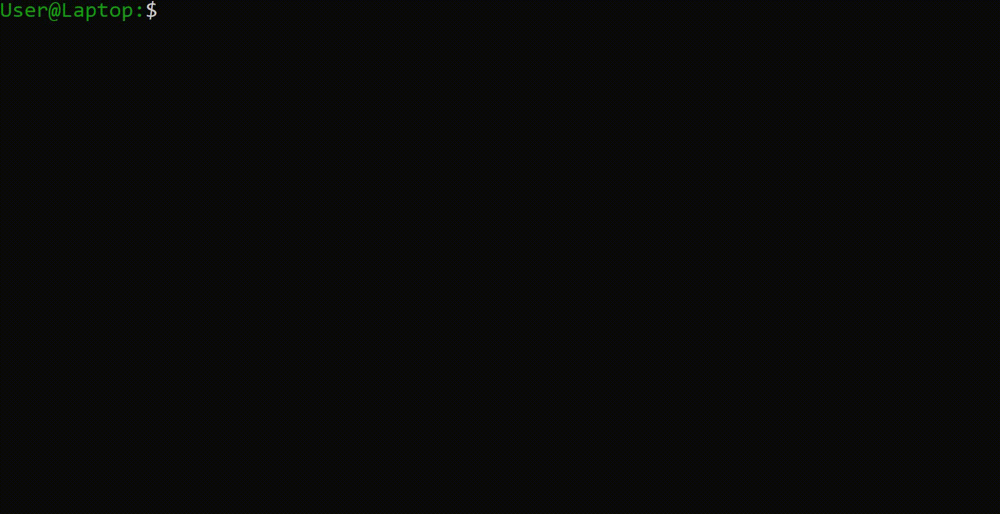

# JShell

JavaShell is a Unix Shell emulator application written in Java and run through terminal. It provides functionality of main commands of Unix Shell, has it's own mock file system tree (where each node is file or directory), and capable of displaying appropriate error messages if used not properly.



# Contents
- [Installation](#installation)
- [Project development](#project-development)
- [Usage](#usage)
- [Credits](#credits)

# Installation

To install and run application open any folder and type 

```console
foo@bar:~$ git clone https://github.com/sashavoit/JShell
foo@bar:~$ cd JShell
foo@bar:~$ mvn -q compile
foo@bar:~$ mvn exec:java
```

# Project development

Project was developed in a team of four following Agile Scrum as using SVN version control. Overall team had 5 sprints. Here you can find [product backlog](productBacklog), [sprint backlogs](sprints), and complete log of [daily SCRUM meetings](dailyScrumMeetings). Here's also a complete set of [CRC cards](crcCards) for each Java class and interface.

# Usage

### output redirection

Any command that has an output supports redirection to a file. Use > to overwrite contents of the file and >> to append.

```console
foo@bar:~$ COMMAND ARGUMENTS > FILE
```


```console
foo@bar:~$ COMMAND ARGUMENTS >> FILE
```


### man command

```console
foo@bar:~$ man COMMAND
```

Prints out the documentation for a given COMMAND into the shell. Outputs error if COMMAND does not exist.



### mkdir command

```console
foo@bar:~$ mkdir DIRECTORY...
```

Creates directory(ies) at given full or relative path(s).

### cd command

```console
foo@bar:~$ cd DIRECTORY
```

Change current working directory to given directory.


### ls command

```console
foo@bar:~$ ls [-R] [DIRECTORY/FILE]...
```

List contents of DIRECTORY, or a location of FILE. If no directory provided, print contents of current working directory.

Options:
- -R list contents recursively 


### echo command

```console
foo@bar:~$ echo "STRING"
```

Outputs STRING. STRING must be surrounded by double quotes.


### cat command

```console
foo@bar:~$ cat FILE...
```

Outputs concatenation of contents of the file(s). 


### exit command

```console
foo@bar:~$ exit
```

End session of JShell.



### mv command

```console
foo@bar:~$ mv SOURCE DEST
```

Move file or directory at SOURCE to location at DEST.



### cp command

```console
foo@bar:~$ cp SOURCE DEST
```

Copy file or directory at SOURCE to location at DEST.


### rm command 

```console
foo@bar:~$ rm DIRECTORY
```

Deletes directory and all it's contents recursively.


### pushd command

```console
foo@bar:~$ pushd DIRECTORY
```

Pushes DIRECTORY onto a directory stack in memory.



### popd command

```console
foo@bar:~$ pushd
```

Changes current working to last directory from the directory stack in memory.


### pwd command

```console
foo@bar:~$ pwd
```

Prints full path to current working directory.



### history command

```console
foo@bar:~$ history [N]
```

Prints history of N last commands entered by user (including history command itself). If number N is not provided, print full history.


### tree command

```console
foo@bar:~$ tree
```

Prints file system tree starting at root directory recursively.


### save command

```console
foo@bar:~$ save FILE
```

Saves state of the JShell to FILE on the real hard drive of the computer. Can be loaded in the next session.


### load command

```console
foo@bar:~$ load FILE
```

Loads the state of the JShell from FILE on the real hard drive of the computer. Must be the first command after the start of the sesion.


### find command

```console
foo@bar:~$ find PATH... -type TYPE -name "NAME" 
```

Looks for node of type TYPE (d or f) with name NAME at location(s) specified by PATH(s). 


### curl command

```console
foo@bar:~$ curl URL 
```

Retrieves a file from URL and saves it to current working directory.



# Credits

This project was developed as part of CSCB07 Software Design course and University of Toronto. Team of developers:
- Raz Ben Haim 
- Kevin Meharchand
- Sankalp Sharma
- Sasha Voitovych (me)
